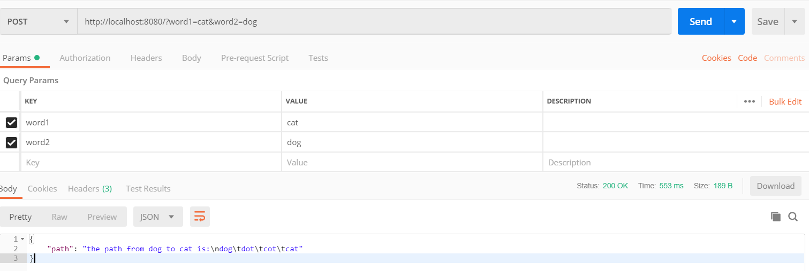
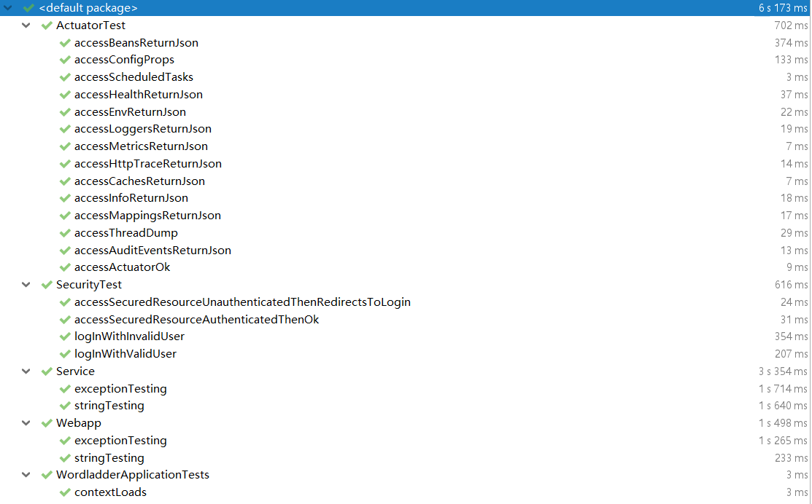
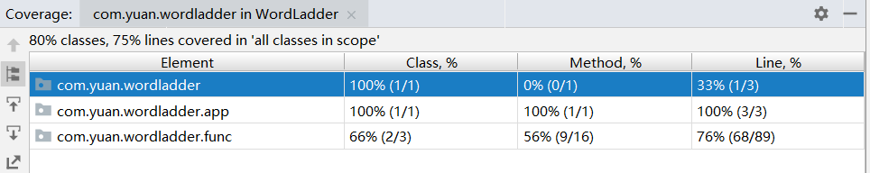

# wordladder by spring-boot

---


## Tutorial

1. _mvn package:_<br>
   编译、测试，并依据项目生成 jar 文件

2. _mvn spring-boot:run_<br>
   在本地启动项目

3. _postman send_:<br>

url format:

```js
http://localhost:8080/?word1={str1}&word2={str2}
```

例子:

```js
http://localhost:8080/?word1=cat&word2=dog
```



## Unit Test

1. 执行

路径

```
src\test\java\com.yuan.test
```

运行结果


2. 说明

- 第一部分： Service 层测试，测试功能函数的执行和边界条件

- 第二部分： Web 层测试，测试对前端请求响应和异常处理

3. 代码覆盖率

使用了 intellij 自带的分析工具，结果：


## gitflow workflow

0. 初始化
   清空以前记录

```
git checkout --orphan latest_branch
git add -A
git commit -am "back to hw1"
git branch -D master
git branch -m master
git push -f origin master
```

1. v1.0

上次作业进度

```
git tag v1.0
git push origin --tag
```

```
git flow init
```

2. v2.0

基本功能实现

```
git flow release start basic-func
git flow release finish basic-func
```

3. v2.1

修复 bug

```
git flow hotfix start basic-cond
git flow hotfix start basic-cond
```

4. v3.0

测试实现

- 为展示流程， publish 了上述 branch
