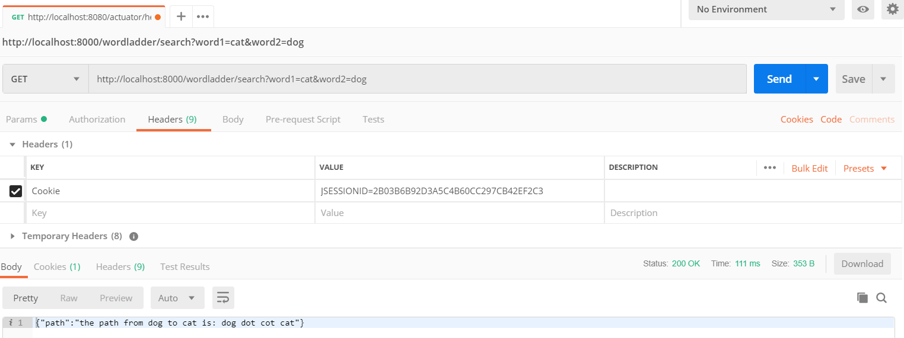

## WordLadder

---

### Tutorial

1. 新建网络

```js
docker network create -d bridge wordladder
```

2. 添加容器

```js
docker run -d -p 8080:8080 --name hub-word-ladder-func yuanzhuo/word-ladder-func:v1.0 --network wordladder
docker run -d -p 8000:8000 --name word-ladder-login hub-yuanzhuo/word-ladder-login:v1.0 --network wordladder
```


3. 访问服务

- [login](http://localhost:8000/login.html)<br>


用户名：任意；密码：123456

- wordladder url format

```
http://localhost:8000/wordladder/search?word1={str1}&word2={str2}
```



### Structure

1. login 服务：
   用户访问 login 服务，进行登录和查询，登录直接处理，查询请求通过请求 wordladder 服务完成
2. wordladder 服务：
   login 接受用户的查询请求向 wordladder 发送请求并接受，主要实现查询功能

### Docker

1. Repo

- [yuanzhuo\word-ladder-login](https://hub.docker.com/r/yuanzhuo/word-ladder-login)

- [yuanzhuo\word-ladder-func](https://hub.docker.com/r/yuanzhuo/word-ladder-func)

2. Dockerfile

- login

```
FROM openjdk:8
EXPOSE 8080
COPY ./login-0.0.1-SNAPSHOT.jar /home/login.jar
ENTRYPOINT [ "java", "-jar", "/home/login.jar" ]
```

- func

```
FROM openjdk:8
EXPOSE 8080
COPY ./wordladder-0.0.1-SNAPSHOT.jar /home/wordladder.jar
ENTRYPOINT [ "java", "-jar", "/home/wordladder.jar" ]
```

3. Nerwork

```js
docker inspect --format='{{.NetworkSettings.IPAddress}}' {container ID}
```

wordladder 服务获取地址为

```css
172.17.0.2
```

### Detail

1. CORS： 跨域访问
2. Spring Resource： 获取资源(dict.txt)
3. HttpClient： 发送和接收 http 请求
